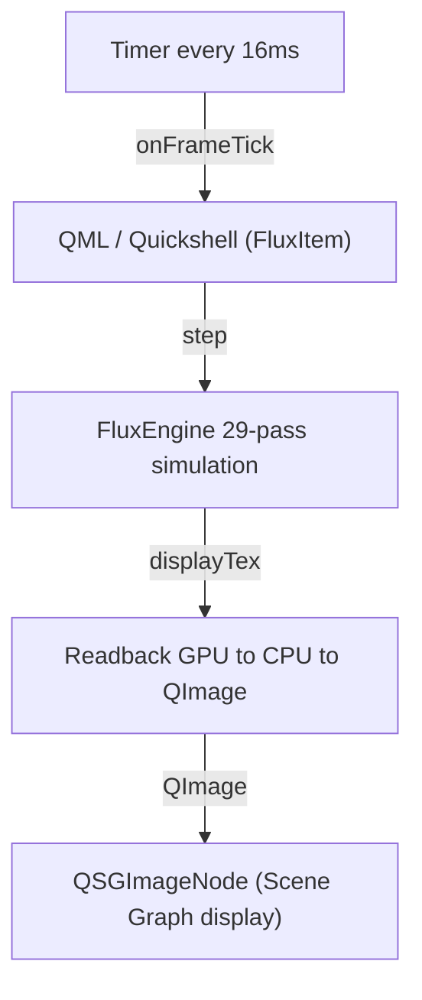
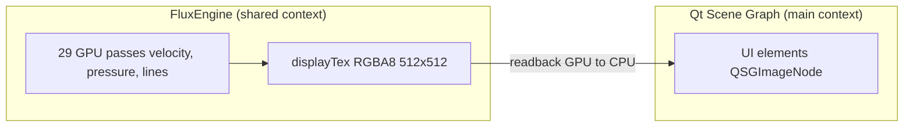
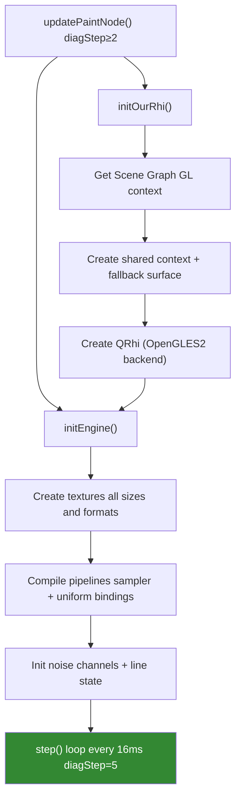
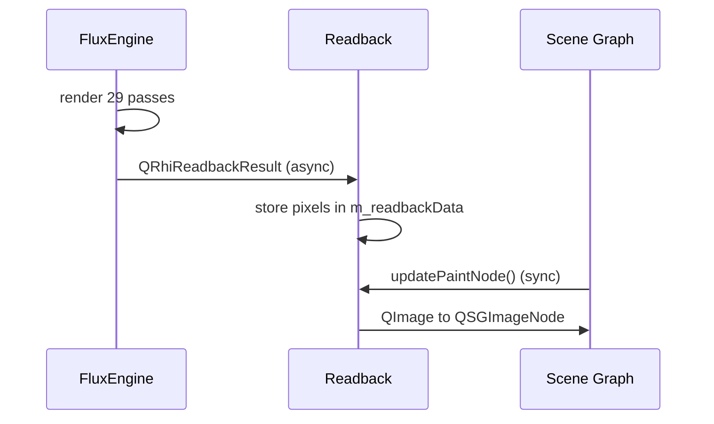
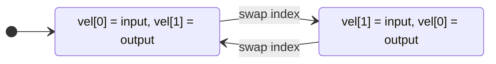

# Architecture

How the fluid simulation engine works under the hood.

---

## Overview



Every frame:
1. A `Timer` (16ms) calls `onFrameTick()` on the `FluxItem`
2. `FluxItem` tells `FluxEngine` to advance the simulation by one step
3. The engine runs 29 GPU passes, updating the velocity and pressure fields
4. The result is copied from GPU memory back to the CPU as pixel data
5. A `QSGImageNode` displays that pixel data on screen

---

## Why a Separate GPU Context?

Qt Quick draws UI elements using its **Scene Graph**, which is optimized for
buttons, text, and images — not for running 29 chained GPU passes per frame.

The fluid engine needs its own private rendering pipeline, so it runs in a
**separate OpenGL context** that shares resources with Qt's context.



The two contexts share access to the same GPU. The engine renders into its
textures, then the result is read back to the CPU and handed to the Scene
Graph as a plain image.

---

## Initialization Sequence

On the first frame, `FluxItem` initializes itself in stages controlled by
the `diagStep` property:



The `diagStep` property (default 5) can be lowered to isolate problems:

| diagStep | What runs |
|---|---|
| 0-1 | `updatePaintNode()` returns null — blank screen |
| 2-3 | GL context created, engine not initialized |
| 4 | Engine initialized, no rendering |
| 5 | Full pipeline — normal operation |

See [development.md Diagnostic Levels](development.md#diagnostic-levels-diagstep).

---

## The Display Pipeline Problem

Qt 6.11 has no reliable way to share a `QRhiTexture` between two separate
`QRhi` instances without crashing. The obvious approach — passing the
display texture directly to the Scene Graph — doesn't work.

The solution is a **readback pipeline**:



Only one readback runs at a time. If a new frame is ready before the
previous readback completes, the frame is skipped — the old image stays on
screen for one extra frame. This prevents a backlog.

---

## File Structure

```
plugin/
├── FluxItem.h / .cpp       QML component (bridges QML to C++)
├── FluxEngine.h / .cpp     Simulation engine (all 29 GPU passes)
├── FluxShaders.h / .cpp    Shader file loader
├── CMakeLists.txt
└── shaders/
    ├── fullscreen_quad.vert        Shared vertex shader
    ├── pass_noise.frag             Phase 0: noise generation
    ├── pass_advect.frag            Phase 1: forward advection
    ├── pass_advect_rev.frag        Phase 2: reverse advection
    ├── pass_adjust.frag            Phase 3: MacCormack correction
    ├── pass_diffuse.frag           Phases 4-6: viscosity diffusion
    ├── pass_inject_noise.frag      Phase 7: apply noise to velocity
    ├── pass_divergence.frag        Phase 8: divergence calculation
    ├── pass_pressure.frag          Phases 9-27: pressure solve
    ├── pass_subtract.frag          Phase 28: subtract pressure gradient
    ├── display_frag.frag           Display: velocity to heatmap
    ├── display_debug.frag          Display: raw texture data
    ├── line_update.comp            Compute: spring dynamics update
    ├── draw_lines_vs.vert          Vertex: instanced line quads
    ├── draw_lines_fs.frag          Fragment: line color and fade
    ├── draw_endpoint_vs.vert       Vertex: line endpoint caps
    └── draw_endpoint_fs.frag       Fragment: endpoint color
```

---

## Texture Formats

| Texture | Format | Size | Contents |
|---|---|---|---|
| `m_velocityTex[2]` | RGBA16F | 128x128 | Velocity field (ping-pong) |
| `m_pressureTex[2]` | R32F | 128x128 | Pressure field (ping-pong) |
| `m_noiseTex` | RGBA16F | 256x256 | Noise (2x fluid size) |
| `m_advectionFwdTex` | RGBA16F | 128x128 | Forward advection result |
| `m_advectionRevTex` | RGBA16F | 128x128 | Reverse advection result |
| `m_divergenceTex` | R32F | 128x128 | Divergence field |
| `m_lineStateTex[2]` | RGBA32F | 256xH | Line state (ping-pong) |
| `m_displayTex` | RGBA8 | 512x512 | Final output for readback |

---

## Ping-Pong Buffers

Most GPU passes cannot read and write to the same texture simultaneously.
The engine uses **ping-pong buffers** — two textures that alternate roles
each iteration.



`m_velocityIndex` and `m_pressureIndex` track which texture is currently
the read side. They flip after every write pass.

---

## Line State Texture Layout

Each flow line stores 3 texels (12 floats) in a tiled texture:

```
Texel 0: [ endpoint.x | endpoint.y | vel.x | vel.y    ]
Texel 1: [ color.r    | color.g    | color.b | color.a ]
Texel 2: [ cvel.r     | cvel.g     | cvel.b  | width   ]
```

The texture is 256 pixels wide (tiled), with `height = ceil(lineCount * 3 / 256)`.
Line state also uses ping-pong (`m_lineStateTex[2]`, `m_lineStateReadIdx`).

---

## Multi-Monitor

Each Quickshell window gets its own `FluxItem`, which creates its own
`FluxEngine` with its own OpenGL context and textures. Monitors do not
share simulation state — each runs independently.

