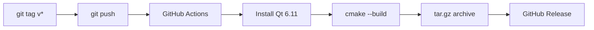

# Building and Installing

---

## Prerequisites

| Software | Version | Notes |
|---|---|---|
| Qt | 6.11+ | Requires qt6-base, qt6-shadertools, qt6-declarative |
| Quickshell | 0.2.1+ | The shell framework the plugin runs inside |
| CMake | 3.20+ | Build system |
| C++ compiler | GCC 11+ or Clang 14+ | C++20 required |
| OpenGL drivers | Mesa 24+ or proprietary | OpenGL 4.6 features required |

### Installing Qt

**Arch Linux:**
```bash
sudo pacman -S qt6-base qt6-shadertools qt6-declarative cmake gcc
```

**Ubuntu / Debian:**
```bash
sudo apt install qt6-base-dev qt6-shadertools-dev qt6-declarative-dev cmake g++
```

---

## Building

```bash
git clone https://github.com/dxnz-id/flux-quickshell.git
cd flux-quickshell/plugin
cmake -Bbuild
cmake --build build -j$(nproc)
```

After a successful build:

```
build/FluxEngine/
├── libfluxengine.so
├── libfluxengineplugin.so
├── shaders/              (compiled .qsb files)
├── qmldir
└── fluxengine.qmltypes
```

---

## How Shaders Are Compiled

Every `.frag`, `.vert`, and `.comp` file in `plugin/shaders/` is compiled
into a `.qsb` file automatically during the CMake build. For example:

```bash
qsb --glsl "440" shaders/pass_advect.frag -o build/FluxEngine/shaders/pass_advect.qsb
```

The `--glsl "440"` flag is required. The `--qt6` flag produces ESSL 100
output that lacks `texelFetch` and `textureSize` — functions the
simulation depends on.

---

## Installing

### Option 1 — Point to the build directory (testing)

```bash
export QML2_IMPORT_PATH="/path/to/flux-quickshell/plugin/build"
quickshell --desktop
```

### Option 2 — Install to user directory (permanent)

```bash
cp -r plugin/build/FluxEngine ~/.local/share/quickshell/imports/
```

### Option 3 — Use a release tarball

Download from `https://github.com/dxnz-id/flux-quickshell/releases`:

```bash
tar xzf FluxEngine-v0.3.1-linux-x86_64.tar.gz \
    -C ~/.local/share/quickshell/imports/
```

---

## Verifying the Installation

```bash
qml6 -c "import FluxEngine 1.0; console.log('FluxEngine OK')"
```

On some distros the command is `qml` instead of `qml6`.

No output after `FluxEngine OK` means the plugin is installed correctly.
A "module not found" error means `QML2_IMPORT_PATH` is not set correctly.

---

## CI / Automated Releases



To publish a new release:

```bash
git tag v0.4.0
git push origin v0.4.0
```

---

## Development Sandbox

For quick iteration without Quickshell:

```bash
cd dev/shader-sandbox
cmake -Bbuild
cmake --build build
./build/shader_sandbox
```

See [development.md](development.md) for details.
