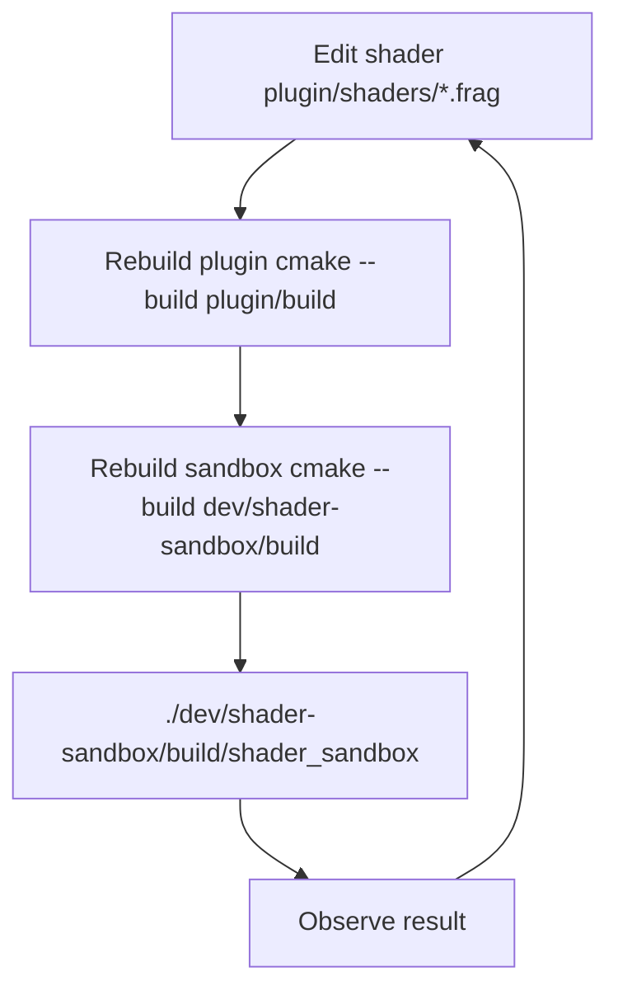

# Development Guide

---

## Project Structure

```
flux-quickshell/
├── README.md
├── docs/               Documentation
├── plugin/
│   ├── CMakeLists.txt
│   ├── FluxItem.h / .cpp     QML component
│   ├── FluxEngine.h / .cpp   Simulation engine
│   ├── FluxShaders.h / .cpp  Shader file loader
│   └── shaders/              GPU programs (.frag .vert .comp)
├── qml/
│   └── FluxBackground.qml   Convenience wrapper
├── dev/
│   ├── shader-sandbox/       Standalone test app
│   └── notes/                Technical notes
└── .github/workflows/        CI/CD
```

---

## Development Workflow



### Setup

```bash
cd plugin
cmake -Bbuild
cmake --build build -j$(nproc)

export QML2_IMPORT_PATH="$PWD/build"

cd ../dev/shader-sandbox
cmake -Bbuild
cmake --build build
./build/shader_sandbox
```

### Important: Stale QSB Files

The sandbox copies compiled shaders from the plugin build directory. The
sandbox itself **does not compile shaders** — it copies pre-compiled
`.qsb` files from `plugin/build/FluxEngine/shaders/`.

If you change a shader but the sandbox still shows old behavior, rebuild
both the plugin **and** the sandbox:

```bash
cmake --build plugin/build
cmake --build dev/shader-sandbox/build
```

---

## Shader Compilation

### The Flag

Always use `--glsl "440"`:

```bash
qsb --glsl "440" input.frag -o output.qsb
```

**Do not use `--qt6`** — it compiles via Vulkan/SPIR-V first, producing
ESSL 100 output. ESSL 100 lacks `texelFetch` and `textureSize`, which are
required by the simulation shaders.

### Manual Compilation

```bash
qsb --glsl "440" plugin/shaders/pass_advect.frag -o /tmp/test.qsb
```

### Shader Search Path

When the engine loads a shader, it searches in this order (first match wins):

1. `QML2_IMPORT_PATH/FluxEngine/shaders/`
2. `applicationDirPath()/shaders/`
3. `applicationDirPath()/../shaders/`
4. `applicationDirPath()/qml/FluxEngine/shaders/`
5. `./shaders/`
6. `./FluxEngine/shaders/`
7. `~/.local/lib/qml/FluxEngine/shaders/`
8. `:/shaders/` (Qt resource system)

---

## Diagnostic Levels (diagStep)

| Value | Behavior |
|---|---|
| 0 | `updatePaintNode()` returns nothing — blank screen |
| 1 | Same as 0 (reserved, behaves identically) |
| 2 | GL context created, engine not initialized |
| 3 | Same as 2 (reserved, behaves identically) |
| 4 | Engine initialized, no rendering |
| 5 | Full pipeline — normal operation |

Levels 0/1 and 2/3 are duplicates. They exist as debugging scaffolding
in case the initialization sequence is ever split into more granular
steps. Leave at 5 for normal use.

---

## Debugging Tips

### Check if the simulation is running

```qml
Timer {
    interval: 1000
    running: true
    repeat: true
    onTriggered: console.log("Frame:", fluid.frameCount)
}
```

If `frameCount` is increasing, the simulation is running.

### Inspect internal fields

```qml
FluxItem { debugMode: 4 }
```

Mode 4 shows divergence — it changes visibly every frame if the solver runs.

### Check for GPU errors

Run from a terminal and watch for:

- `QRhiGraphicsPipeline::create failed`
- `Texture format not supported`
- `RGBA16F render targets not supported!` (GPU driver too old)

---

## Troubleshooting

### Plugin not found

`QML2_IMPORT_PATH` is not set or points to the wrong directory. Point
it to `plugin/build`:

```bash
export QML2_IMPORT_PATH="/path/to/flux-quickshell/plugin/build"
```

### Black screen, no errors

Check `frameCount` in QML. If it stays at 0, make sure `diagStep ≥ 5`
and `running` is true:

```qml
Timer {
    interval: 1000
    running: true
    repeat: true
    onTriggered: console.log("Frame:", fluid.frameCount, "diagStep:", fluid.diagStep)
}
```

### Simulation runs but no lines visible

`noiseMultiplier` is too low or zero. The fluid needs noise energy to
move. Try `noiseMultiplier: 0.45`.

### Low FPS or stutter

The engine runs 29 GPU passes every frame. On integrated GPUs, try:

- Lower `pressureIterations` (start with 10 instead of 19)
- Lower `simSize` (start with 64 instead of 128)

### FPS counter shows unexpectedly low numbers

The built-in FPS counter counts `engine->step()` calls, not display
frame rate. If the counter shows 60 but the display feels sluggish,
the bottleneck is the readback + `QImage` → `QSGImageNode` upload path.

---

## Known Qt 6.11 Bugs

### 1. Cleanup crash at exit

**Problem:** Qt destroys the OpenGL context before calling
`releaseResources()`. The engine's destructor tries to delete GPU resources
with no valid context, causing a crash.

**Workaround:** Detect the condition and skip cleanup. The OS reclaims all
GPU memory when the process exits anyway.

### 2. `QSGGeometryNode` doesn't render in RHI mode

**Problem:** In Qt 6.11, `new QSGGeometryNode()` or
`new QSGSimpleTextureNode()` produce nothing on screen when RHI is the
rendering backend.

**Solution:** Use `window()->createImageNode()`. Nodes created via
`QQuickWindow` factory methods work correctly.

### 3. `createTextureFromRhiTexture` crashes across contexts

**Problem:** Qt's API to share a `QRhiTexture` with the Scene Graph crashes
if the texture was created in a different `QRhi` instance.

**Solution:** Use the readback pipeline (GPU to CPU to `QImage` to display).
Slower, but stable across all GPUs and drivers.

### 4. `FrameAnimation` doesn't fire in sandbox

**Problem:** Quickshell's `FrameAnimation.triggered` signal doesn't fire
when running outside Quickshell (for example in the sandbox app or `qml6`).

**Solution:** Use a plain `Timer { interval: 16 }` to call `onFrameTick()`
manually.

---

## Design Decisions

### Why C++ QRhi over QML ShaderEffect?

An earlier prototype ran the simulation entirely in QML `ShaderEffect`.
It was abandoned due to hard Qt 6.11 limitations:

| Limitation | Impact |
|---|---|
| 1 sampler per ShaderEffect | MacCormack needs 3 simultaneous texture inputs |
| No compute shaders | Spring dynamics particle system can't run on GPU |
| RGBA8 clamp | Negative velocity values are clamped to 0 |
| No uniform block mapping | Can't pass parameters from QML properties |

The C++ QRhi plugin approach has none of these restrictions.

### Why a separate GPU context?

The Qt Scene Graph is optimized for UI elements — buttons, text, images.
Running 29 chained GPU passes per frame would conflict with its rendering.
The engine creates its own OpenGL context (shared with Qt's context) and
runs independently.

### Why readback instead of direct texture sharing?

Qt 6.11 has no stable way to share a `QRhiTexture` between two separate
`QRhi` instances (see [Known Qt 6.11 Bugs](#3-createtexturefromrhitexture-crashes-across-contexts)).
The readback pipeline — GPU → CPU → QImage → display — is slower but
works reliably across all GPUs and drivers.

---

## Contributing

1. Fork the repository
2. Create a feature branch
3. Make changes and test with the sandbox
4. Submit a pull request

### Code Style

- **C++**: C++20, smart pointers, avoid raw `new`/`delete`
- **Shaders**: GLSL 420+
- **Comments**: English
- **Commit messages**: conventional commits (`fix:`, `feat:`, `docs:`, `refactor:`)
