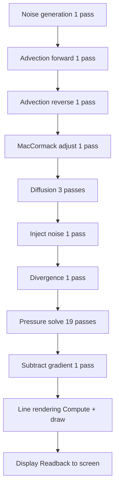
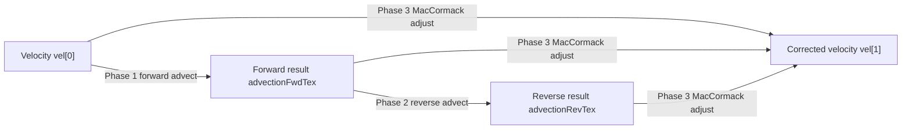
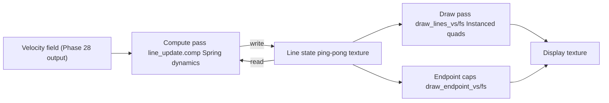

# Simulation Pipeline

Every frame, the engine runs 29 GPU passes to simulate fluid motion,
then renders the result as animated flow lines.

---

## The Phases at a Glance



---

## Phase 0 — Noise Generation

The fluid needs a continuous energy source, otherwise viscosity would
slow it to a stop. Noise acts as that energy: a smoothly-evolving force
field that pushes the fluid in varying directions.

Noise is computed in two stages:

1. **CPU** — Every frame, three noise channels are ticked forward.
   Each channel has an offset that drifts over time at a different speed:

   | Channel | Scale | Multiplier | Drift/frame |
   |---|---|---|---|
   | 0 | 2.8 | 1.0 | 0.001 |
   | 1 | 15.0 | 0.7 | 0.006 |
   | 2 | 30.0 | 0.5 | 0.012 |

   Each channel blends between two offset values to prevent repeating
   patterns. When `offset_1 > 4.0`, a second offset begins fading in;
   when the blend is complete, the values swap and the cycle restarts.

2. **GPU** (`pass_noise.frag`) — The CPU uploads the channel parameters
   as a uniform buffer. The shader generates a 256x256 Simplex noise
   texture by summing all three channels.

---

## Phases 1-3 — MacCormack Advection

**Advection** moves the velocity field along with the fluid itself —
like labels floating on the surface of a river.



**Phase 1 — Forward advection** (`pass_advect.frag`):
For each pixel, trace backward along the current velocity to find where
the fluid came from, and sample the velocity there.

```
advected_pos = uv - dt * velocity(uv)
vel_new = velocity(advected_pos) / (1 + dissipation * dt)
```

**Phase 2 — Reverse advection** (`pass_advect_rev.frag`):
Same shader, direction reversed (+dt instead of -dt). Start from the
forward result and trace back to where it came from.

**Phase 3 — MacCormack correction** (`pass_adjust.frag`):
Combine forward and reverse to cancel out the advection error:

```
adjusted = forward + 0.5 * (original - reverse)
final = clamp(adjusted, min(neighbors), max(neighbors))
```

The clamp to neighbor bounds prevents the correction from introducing
new extremes that destabilize the simulation.

---

## Phases 4-6 — Diffusion (Viscosity)

Diffusion spreads velocity from each cell to its neighbors, simulating
the internal friction of the fluid (viscosity).

**Shader:** `pass_diffuse.frag`

The pass runs 3 times with ping-pong buffers. Each iteration:

```
center_factor = 1 / (viscosity * dt)
stencil_factor = 1 / (4 + center_factor)
vel_new = stencil_factor * (left + right + up + down + center_factor * vel)
```

This is a **Jacobi iteration** — each pass reads from the previous
output, converging toward the diffused solution.

Higher `viscosity` means more mixing, slower, smoother fluid.

---

## Phase 7 — Inject Noise

The noise texture from Phase 0 is added to the velocity field:

```
vel_new = vel + timestep * noiseMultiplier * noise
```

**Shader:** `pass_inject_noise.frag`

This happens after diffusion so the energy is added to the already-
smoothed velocity, not mixed back into the diffusion iterations.

---

## Phase 8 — Divergence

**Divergence** measures whether fluid appears to be created or destroyed
at each cell. In a real incompressible fluid, divergence must be zero
everywhere.

**Shader:** `pass_divergence.frag`

```
div = 0.5 * ((vel_right.x - vel_left.x) + (vel_up.y - vel_down.y))
```

Any non-zero divergence is an error introduced by the advection and
diffusion steps. The pressure solve corrects it.

---

## Phases 9-27 — Pressure Solve (x19)

The pressure solve finds a pressure field whose gradient, when subtracted
from the velocity, eliminates all divergence.

**Shader:** `pass_pressure.frag`

Each Jacobi iteration:

```
alpha = -1.0
r_beta = 0.25
p_new = r_beta * (p_left + p_right + p_up + p_down + alpha * divergence)
```

After 19 iterations, the pressure field has converged enough to make the
velocity approximately divergence-free.

Boundary conditions: at the edges of the grid, the pressure gradient
normal to the boundary is forced to zero (Neumann BC), implemented via
texture clamping.

---

## Phase 28 — Subtract Gradient

The final phase applies the pressure correction:

**Shader:** `pass_subtract.frag`

```
grad_p = 0.5 * (p_right - p_left, p_up - p_down)
vel_new = vel - grad_p
```

At the grid boundary, velocity is forced to zero (**no-slip** boundary
condition) — the fluid cannot flow through the walls.

---

## Line Rendering

After the 28 solver passes, the engine runs the particle system that
renders the animated flow lines.



### Particle Grid

Lines are arranged on a fixed uniform grid across the screen. Grid
spacing is 15 pixels (in logical screen coordinates). The number of
lines scales automatically with window size.

### Spring Dynamics (Compute Shader)

Each line has persistent state across frames: endpoint position,
velocity, color, and width. The compute shader (`line_update.comp`)
updates every line in parallel on the GPU:

```
variance = per_line_value in [1 - lineVariance, 1.0]
momentum_boost = mix(3.0, 5.0, variance)
delta_boost = mix(3.0, 25.0, 1 - variance)

vel_new = (1 - dt * momentum_boost) * vel_line
        + (line_length * fluid_vel - endpoint) * delta_boost * dt

endpoint = endpoint + dt * vel_new
```

This creates smooth, organic motion — the lines have momentum so they
don't snap instantly when the fluid changes direction.

### Color Modes

The `colorPreset` QML property accepts values 0–5, which map to three
internal shader modes:

| Mode | colorPreset values | Color source |
|---|---|---|
| Original | 0 | Blue/teal tones from fluid velocity magnitude |
| Color Wheel | 1, 2, 5 | Rainbow by flow direction angle (3 palettes) |
| Image Texture | 3, 4 | Lookup texture (gradient or noise) |

See [api.md Color Presets](api.md#color-presets) for the full list.

Color transitions use their own momentum (`color_velocity`), so hue
changes are smooth even when the underlying fluid direction changes
rapidly.

### Rendering

Lines are drawn as instanced thin quads — one draw call for all lines.
The vertex shader reads the line state texture using `gl_InstanceIndex`
to find each line's endpoint, then expands it into a quad perpendicular
to the line direction.

Endpoint caps (small rounded dots) are drawn in a second instanced pass.

Both passes use **additive blending** — overlapping lines get brighter,
creating a glowing effect where lines cluster together.

---

## Display

After all rendering is complete, `displayTex` (RGBA8) is read back from
GPU to CPU memory, converted to a `QImage`, and passed to the Qt Scene
Graph for display.

The default size is 512x512, but it adapts to the window dimensions on
the first frame after the item is resized.

**Two paths into `displayTex`:**
- **Modes 0-4** — the heatmap or debug shader renders the selected field
  into the texture via a draw pass.
- **Mode 5 (default)** — line rendering writes directly into `displayTex`
  via its own render pass. No heatmap shader is involved.

The `debugMode` property controls what gets rendered into the display
texture before readback:

| Value | Display |
|---|---|
| 0 | Velocity heatmap: blue (slow) → yellow → red (fast) |
| 1 | Raw noise texture |
| 2 | Raw velocity field |
| 3 | Pressure field |
| 4 | Divergence field |
| 5 | Flow lines (default) |

> **Note:** `display_frag.frag` hardcodes `gl_FragCoord.xy * 0.5` to map
> from the display texture (512) down to the velocity texture (128). If
> `displaySize` changes significantly from 512, this scaling breaks.

---

## CPU vs GPU

| Runs on CPU | Runs on GPU |
|---|---|
| Noise channel ticking (3 channels x drift/frame) | All 29 solver passes |
| Line noise offset ticking (`tickLineNoise`) | Line spring dynamics (compute shader) |
| Noise upload (GpuNoiseParams → uniform buffer) | Line rendering (vertex + fragment) |
| Readback (displayTex → QImage) | Display heatmap / debug shader |
| QImage → QSGImageNode texture upload | |
